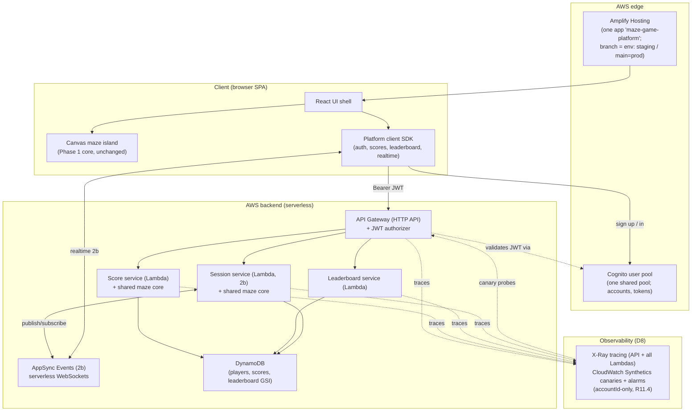

# Design Document

## Overview

The Maze Game Platform (Phase 2) turns the single-player maze game into an account-based,
score-tracking, multiplayer platform on AWS. It adds real accounts, server-validated
persistent scores, a leaderboard, and concurrent play (Phase 2a), then real-time shared
sessions where players race the same maze live (Phase 2b).

The central design constraint, inherited from the architecture and business-model steering,
is that the **Phase 1 pure core is reused unchanged**. Maze generation/validation, movement,
timing, and win/loss remain pure, deterministic functions. Everything new — identity,
persistence, ranking, networking, and a modern UI — is added as **ports and cloud adapters
around that core**. The same core that runs client-side for a solo run also runs
**server-side** to validate a submitted score and to hold authoritative shared-session state,
which is what makes anti-cheat and fair real-time racing possible without duplicating rules.

This design commits the AWS choices recorded as recommendations in `docs/aws-decisions.md`
into the baseline stack, and adopts the deploy-first / walking-skeleton strategy: IaC and the
deploy pipeline come first, a thin end-to-end slice is deployed before feature depth, and each
cloud seam is integration-tested against the real deployed shared backend.

### Requirement Coverage Map

| Requirement | Design element |
| --- | --- |
| R1 Create Account | Cognito user pool, sign-up flow, `AuthProvider` port |
| R2 Sign In/Out | Cognito auth, JWT sessions, API Gateway JWT authorizer |
| R3 Recover access | Cognito forgot-password flow |
| R4 Persist Score | `POST /scores` → Score Lambda → server-side `replayRun` validation → DynamoDB; `ScoreRepository` port |
| R5 Personal scores/history | `GET /scores/me`, `GET /scores/me/best`, single-table access patterns |
| R6 Leaderboard | `GET /leaderboard`, leaderboard GSI (baseline) with Redis-ranking pivot documented |
| R7 Concurrency | Serverless horizontal scale; conditional writes; idempotent submission |
| R8 Join shared session | Session Lambda + AppSync Events channel; server-created maze |
| R9 Real-time updates | Server-authoritative `SharedSessionState` on the server; AppSync Events fan-out |
| R10 Resolve/record session | Authoritative resolution → Score persistence (reuses R4 path) |
| R11 Security/privacy | Cognito, TLS, per-account authorization, least-privilege IAM, PII policy |
| R12 Modern/responsive/accessible UI | React SPA + Canvas island, responsive/a11y criteria |
| Observability (X-Ray + Synthetics) | X-Ray tracing + Synthetics canaries + CloudWatch alarms verify R6.4/R6.5 (leaderboard budget), R7.2 (load/latency posture); `accountId`-only traces satisfy R11.4 (no secrets) — see D8 |

## Scope and Increments

- **Phase 2a (Requirements 1–7, 11, 12):** accounts, sign-in, recovery, score persistence,
  personal history, leaderboard, concurrent independent play, security, and the modern UI.
  Shippable on its own.
- **Phase 2b (Requirements 8–10):** real-time shared sessions, layered on the 2a services and
  data model. Depends on 2a being deployed.

## Architecture

### System context

The Platform is a browser **single-page application (SPA)** talking to a **serverless AWS
backend**. The SPA embeds the Phase 1 maze core (unchanged) for local, fluid gameplay; the
backend embeds the same core (as a shared package) for server-side validation and, in 2b,
authoritative shared-session state.



### Baseline stack (committed from `docs/aws-decisions.md`)

| Concern | Choice | Requirement |
| --- | --- | --- |
| Backend IaC | AWS CDK (TypeScript), one shared `MazeGamePlatform` stack (no per-env duplication) | deploy-first strategy, D6 |
| CI/CD | GitHub Actions → AWS via OIDC (no static keys) | deploy-first strategy, D6 |
| Frontend hosting | AWS Amplify Hosting, one app `maze-game-platform`; branch = env (`main` = prod, `staging` = staging) | R12, D7 |
| Environments & gates | `staging` branch → `main` (prod), gates G0–G3, manual approval to prod; both branches serve the shared backend | D7 |
| Identity | Amazon Cognito user pool (one shared pool; retain on delete) | R1, R2, R3, R11 |
| API / compute | API Gateway (HTTP API) + Lambda (TypeScript) | R4–R10 |
| Persistence | DynamoDB (on-demand), one shared single-table (`RETAIN` + point-in-time recovery) | R4, R5, R7 |
| Leaderboard ranking | DynamoDB GSI (baseline); Redis pivot documented | R6 |
| Real-time (2b) | AppSync Events (serverless WebSockets) | R8–R10 |
| Client | React SPA + Canvas island for the maze | R12 |

Rationale for each choice, the timeline, and the pivot discriminators are in
`docs/aws-decisions.md`; this design commits them and does not restate the rationale.

### Hexagonal boundaries (new ports)

The Phase 1 layering (`core` pure, `app` orchestration, `edges` adapters) is preserved. Phase
2 introduces new **ports** consumed by the app/services and new **adapters** implementing them
against AWS. The core is never modified.

| Port (interface) | Purpose | Adapter(s) |
| --- | --- | --- |
| `AuthProvider` | sign-up/in/out, recovery, current identity | `CognitoAuthProvider` (client); JWT verification (server) |
| `ScoreRepository` | persist/read scores and personal bests | `DynamoScoreRepository` |
| `LeaderboardQuery` | ranked reads, own-rank | `DynamoLeaderboardQuery` (GSI); `RedisLeaderboardQuery` (pivot) |
| `SessionChannel` (2b) | join, publish/subscribe realtime updates | `AppSyncEventsChannel` |
| `Clock` (reused) | time source | `SystemClock` (client) / Lambda-side clock (server) |

The **shared maze core package** (the Phase 1 `src/core`) is depended on by both the client
and the Lambda services, so score validation and authoritative session state use exactly the
same rules as gameplay.

## Components and Interfaces

_Phase 2a. (Phase 2b components follow in a later section.)_

### Identity (R1–R3, R11)

Amazon Cognito user pool provides sign-up, sign-in, hosted verification, forgot-password
recovery, hashed credential storage, and JWT issuance. The client uses an `AuthProvider` port
so the rest of the app never touches Cognito APIs directly (Dependency Inversion), keeping a
pivot to another identity provider a matter of swapping the adapter.

```typescript
export interface AuthProvider {
  signUp(identifier: string, credential: string, displayName: string): Promise<SignUpResult>;
  confirm(identifier: string, code: string): Promise<void>;
  signIn(identifier: string, credential: string): Promise<AuthSession>;
  signOut(): Promise<void>;
  currentSession(): AuthSession | null;
  startRecovery(identifier: string): Promise<void>;
  completeRecovery(identifier: string, code: string, newCredential: string): Promise<void>;
}

export interface AuthSession {
  readonly accessToken: string; // JWT, bounded lifetime (R2.4)
  readonly displayName: string;
  readonly expiresAt: number;
}
```

Server side, API Gateway's **JWT authorizer** validates the Cognito-issued token before any
Lambda runs, satisfying "reject unauthenticated actions" (R4.3, R5.3) at the edge. Failed
sign-in throttling (R2.5) and recovery-mechanism expiry (R3.2, R3.3) are Cognito features
configured in IaC.

### Score submission and validation (R4, R7)

The score path is the anti-cheat centerpiece. The client plays a Run locally, then submits the
**move sequence and seed**, not just a claimed time. The Score Lambda **replays the run through
the shared maze core** and derives the authoritative time; it persists only if the replay is a
valid win consistent with the submitted maze parameters (R4.6).

```typescript
export interface ScoreSubmission {
  readonly mazeParams: MazeParams;   // size/difficulty + generation seed
  readonly moves: ReadonlyArray<Direction>;
  readonly clientElapsedMs: number;  // advisory only; server recomputes
  readonly idempotencyKey: string;   // dedupe concurrent/retried submits (R7.4)
}

export interface ScoreRepository {
  putScore(accountId: string, score: Score): Promise<PutScoreResult>;
  personalBest(accountId: string, params: MazeParams): Promise<Score | null>;
  listByAccount(accountId: string, page?: PageToken): Promise<Page<Score>>;
}
```

Validation pipeline (pure core reused): rebuild the maze from `mazeParams` via the Phase 1
`MazeFactory` + seeded generator → replay `moves` through `reduce`/`resolveMove` → require a
`Won` terminal state → take `elapsedMs` from the authoritative result. A malformed or
non-winning submission is rejected (R4.4). `idempotencyKey` plus a conditional write makes
concurrent/duplicate submissions safe (R7.4).

## Data Models

### Data model (DynamoDB single-table) (R4, R5, R6, R7)

One table with a partition/sort key scheme plus a leaderboard GSI. Illustrative item shapes:

| Entity | PK | SK | Notes |
| --- | --- | --- | --- |
| Player profile | `ACCT#<accountId>` | `PROFILE` | displayName, createdAt |
| Score | `ACCT#<accountId>` | `SCORE#<params>#<ts>` | time, params, sessionId? |
| Personal best | `ACCT#<accountId>` | `BEST#<params>` | conditional-write updated (R4.5) |
| Leaderboard entry (GSI) | GSI1PK `LB#<params>` | GSI1SK `<zeroPaddedTimeMs>#<accountId>` | ascending time = ascending rank |

The leaderboard GSI is keyed so that a `Query` in ascending sort order returns fastest-first
(R6.1), and the top segment is a bounded `Query` (R6.4). Own-rank (R6.3) is served by counting
entries with a better time for the params; at small/medium scale this is a bounded query, and
**if exact rank at large scale becomes a requirement, the design pivots to a Redis sorted-set
ranking index** per the D3 discriminator — behind the same `LeaderboardQuery` port, so callers
do not change.

### Leaderboard freshness (R6.5)

Scores are written to the table and the GSI in the same transaction/write, so a qualifying
score appears in subsequent leaderboard reads immediately (GSI propagation is near-real-time);
the stated freshness bound is met without a separate pipeline. (If a Redis index is adopted,
the write path updates both DynamoDB and the sorted set.)

## API Surface and Client (Phase 2a)

### API surface (Phase 2a)

| Method + path | Auth | Requirement |
| --- | --- | --- |
| `POST /scores` | JWT | R4 |
| `GET /scores/me` | JWT | R5.1 |
| `GET /scores/me/best?params=` | JWT | R5.2 |
| `GET /leaderboard?params=` | public | R6.1, R6.2 |
| `GET /leaderboard/me?params=` | JWT | R6.3 |

### Client UI (R12)

A **React SPA** provides the modern, responsive shell (auth screens, score history,
leaderboard, run setup). The maze itself stays a **Canvas island** rendering the unchanged
Phase 1 core, so gameplay stays fluid (R12.2) while the surrounding chrome is componentized.
Accessibility (R12.4) follows the engineering-standards guidance: keyboard operability, visible
focus, and perceivable feedback for auth/run/score/leaderboard state. Network/backend failures
surface explicit states (R12.5).

## Components and Interfaces — Phase 2b (Real-time shared sessions)

### Server-authoritative shared session (R8–R10)

A Shared_Session is created and owned by the **Session service (Lambda)**, which holds the
`Authoritative_State` and is the single source of truth. Clients send intended moves; the
server resolves each against the authoritative state **using the same pure core**
(`resolveMove`), rejecting illegal or out-of-order moves (R9.3) exactly as solo play does.

```typescript
export interface SharedSessionState {
  readonly sessionId: string;
  readonly maze: Maze;                 // identical for all participants (R8.1)
  readonly timeLimit: TimeLimit;
  readonly participants: ReadonlyMap<string, ParticipantState>; // authoritative positions
  readonly status: "Lobby" | "Racing" | "Ended";
  readonly startedAt: number;
}

export interface SessionChannel {
  join(sessionId: string, token: string): Promise<void>;
  publishMove(sessionId: string, move: Direction): Promise<void>; // resolved server-side
  onUpdate(handler: (u: SessionUpdate) => void): Unsubscribe;
}
```

### Real-time transport (R9)

**AppSync Events** provides serverless WebSocket pub/sub: the server publishes authoritative
`SessionUpdate`s (participant progress, joins, disconnects, results) and clients subscribe.
Latency budget (R9.1) is met by publishing minimal diffs from the authoritative state.
Disconnect/reconnect (R9.4, R9.5) is handled by the server retaining authoritative state and
re-sending the current snapshot on resubscribe.

### Resolution and recording (R10)

When a Participant reaches the exit or time expires, the server records finishing time/rank
**from the authoritative state** and, for qualifying results, persists a Score through the
**same R4 path** (`ScoreRepository`), so shared-session results feed the same leaderboard
(R10.3). This reuse is why 2b depends on 2a.

## Deploy-First Delivery and Integration Seams

Per the strategy in `docs/aws-decisions.md`, work proceeds deploy-first:

1. **Backend IaC + branch environments + OIDC pipeline first** (CDK app, GitHub Actions → AWS
   via OIDC), and **Amplify Hosting branch environments** for the frontend. This must exist
   and pass **Gate G0** before feature work — defining gates late reverts to cascade.
2. **Walking skeleton deployed before feature depth:** sign in → submit one validated score →
   read it back → see it on the leaderboard, end-to-end on a real (staging) environment
   (**Gate G1**).
3. **Each cloud seam is integration-tested against a real deployed environment**, mirroring
   the Phase 1 in-process integration points one boundary out:

| Cloud seam | Integration test |
| --- | --- |
| client ↔ Cognito | auth-flow test against a real user pool (sign-up→confirm→sign-in→token) |
| client ↔ API | contract/integration test at the API boundary with a real JWT |
| API ↔ DynamoDB | Lambda ↔ real table (put/get/query, conditional writes, GSI read) |
| score validation | server-side `replayRun` rejects tampered submissions (unearned time) |
| client ↔ realtime (2b) | AppSync Events publish/subscribe round-trip on the deployed env |
| canary ↔ leaderboard/health (read-only) | 5-min Synthetics canary probes public `GET /leaderboard` + health; alarms on availability + leaderboard p95/freshness |
| canary ↔ full flow (walking skeleton) | 30-min Synthetics canary walks sign in → submit validated score → read back → leaderboard, using a reserved synthetic account with self-cleanup |

X-Ray active tracing backs these seams end to end: each seam's request produces a trace whose
subsegments show the API Gateway hop and the downstream DynamoDB/Cognito calls, so a failing
seam is diagnosable from the trace rather than logs alone (see "Observability" below).

### Observability

The shared backend is observed with **AWS X-Ray tracing**, **CloudWatch Synthetics canaries**,
and **CloudWatch alarms**, per `docs/aws-decisions.md` **D8**. Observability is an
**edge/monitoring** concern and follows the hexagonal rule: it lives at the adapters and
composition roots, and the pure `src/core` is **neither traced nor modified**.

- **X-Ray distributed tracing.** Active tracing is enabled on the API Gateway (HTTP API) and on
  **all** Lambdas — score, personal-history, leaderboard, own-rank, delete-account,
  profile-on-signup, and in Phase 2b the Session Lambda and the AppSync path. AWS SDK v3 clients
  are instrumented so DynamoDB (and Cognito) calls appear as **subsegments**, and the managed
  X-Ray write permission is granted **per function**. Traces and annotations carry
  **`accountId` only** — never credentials, tokens, email, or PII (R11.4) — matching the
  backend's logging posture.
- **Synthetics canaries.** (1) An always-on **read-only** canary probes the public
  `GET /leaderboard` plus a health endpoint every **5 minutes**; (2) an **occasional full-flow**
  canary walks the walking-skeleton path (sign in → submit a validated score → read it back →
  see it on the leaderboard) every **30 minutes**, using a **reserved synthetic account** and
  cleaning up its own scores through the account-deletion path (R11.5 / task 11.2). Cadence
  values are **adjustable defaults**.
- **Alarms & budgets.** CloudWatch alarms watch availability and the leaderboard
  latency/freshness budgets already stated in the requirements (top-50 p95 < 300 ms, freshness
  < 2 s — R6.4/R6.5/R7.2). X-Ray fault-rate and p95 posture back the same budgets.
- **Shared-backend consequence.** Because there is one backend and one live leaderboard, the
  full-flow canary **writes a synthetic entry to the one live leaderboard each run**; this is
  mitigated by the reserved synthetic account plus its self-cleanup, and is an accepted
  consequence of the single-backend / shared-data model (D6/D7).
- **Local inspection.** The repo distributes a workspace **CloudWatch Application Signals MCP**
  server so developers can query traces, canary results, and service audits locally (see the
  `dev-environment` steering doc). MCP is a local developer aid, not part of CI or the deployed
  system.

Observability supports the budget/posture requirements (R6.4, R6.5, R7.2) and the no-secrets
privacy requirement (R11.4); see the Requirement Coverage Map.

### Deployment Gates & Environments

The frontend uses **Amplify Hosting's branch-based environments** in **one app**
(`maze-game-platform`), where the **Git branch identifies the environment** (`staging` =
staging, `main` = prod); the backend is a **single, shared, environment-agnostic**
`MazeGamePlatform` stack deployed by **CDK** (hybrid). Both branches serve that same shared
backend. Environments flow **`staging` branch → `main` (prod)**. Promotion to prod is a
**manual-approval gate**. These gates are **front-loaded** — G0 is a hard prerequisite before
any feature task — so integration and deployment problems surface continuously rather than at
the end.

Because there is one backend and one database, **staging and prod share live data** (the same
DynamoDB table and leaderboard); staging is a frontend preview of the same live backend.
Isolation is **per-account within the single backend** (R11.2), not per-environment — see
`docs/aws-decisions.md` D6/D7.

| Gate | Branch → environment | Trigger | Blocking exit criteria |
| --- | --- | --- | --- |
| **G0** Pipeline works | first setup | first setup | OIDC pipeline + single shared backend + one Amplify app with branch envs provisioned; a trivial frontend+backend deploy succeeds |
| **G1** Walking skeleton | `staging` branch | thin slice ready | end-to-end slice (auth → score → read back → leaderboard) deployed on the `staging` branch against the shared backend; **all cloud-seam integration tests green** against the real deployed backend |
| **G2** Phase 2a → prod | `staging` → `main` | 2a feature-complete | all 2a seam tests green; ≥ 90% core coverage; leaderboard/score load budgets met; **Synthetics canaries green (availability + leaderboard p95/freshness budgets) and X-Ray shows no elevated fault rate / p95 within budget**; security & privacy (R11) verified; **manual approval**; rollback plan stated |
| **G3** Phase 2b → prod | `staging` → `main` | 2b feature-complete | realtime seam tests green; realtime latency budget met; shared-session results persist to the shared leaderboard; **realtime-path Synthetics/X-Ray green (no elevated fault rate, realtime p95 within budget)**; **manual approval** |

Gate ownership maps to the branch model: deploying the `staging` branch exercises the staging
frontend against the shared backend and runs the seam tests (G1); merging to `main` promotes
the prod frontend behind the manual-approval gate (G2/G3). A gate that fails blocks the
promotion; `main` stays deployable.

## Error Handling

- **Unauthenticated/expired token:** rejected at the API Gateway JWT authorizer before Lambda
  (R2.4, R4.3, R5.3); client surfaces a re-authentication state (R12.5).
- **Invalid/tampered score:** server-side replay fails → `400`, nothing persisted (R4.4, R4.6).
- **Duplicate/concurrent submission:** `idempotencyKey` + DynamoDB conditional write → single
  consistent result, no lost valid score (R7.4).
- **Capacity exceeded:** serverless auto-scales; beyond limits, return `429`/deferral with a
  clear indication rather than corrupting accepted scores (R7.3).
- **Realtime conflict (2b):** server rejects moves inconsistent with authoritative state,
  position unchanged (R9.3).
- **Disconnect (2b):** session continues for others; reconnect restores authoritative snapshot
  (R9.4, R9.5).
- **Expected failures are typed data, not exceptions**, consistent with the core's result-type
  convention; unexpected server faults return `5xx` and are logged **without** credentials or
  full tokens (R11.4).

## Testing Strategy

Follows the testing steering doc (TDD, PBT, ≥90% core coverage) and its integration-at-seams
convention.

- **Reused pure core** keeps its Phase 1 property-based tests; no new rules are added to it.
- **New pure logic** (score-validation orchestration, leaderboard key encoding, own-rank
  computation, shared-session reducer for authoritative moves) is unit- and property-tested
  with faked adapters — e.g. a property that *a submitted move sequence validates to a Won
  score if and only if it is a solvable path within the time limit*, and that *leaderboard key
  encoding preserves ascending-time ordering for any set of times*.
- **Adapter tests** for the Cognito, DynamoDB, and AppSync adapters run against local fakes for
  fast feedback and against the **real deployed shared backend** (via the `staging` branch) at
  the integration seams above.
- **Deploy-first integration tests** (the seam table) run in CI against the real deployed
  shared backend (provisioned by CDK, frontend by Amplify on the `staging` branch), gating
  promotion (G1).
- **UI** gets component tests for auth/score/leaderboard states and accessibility checks
  (keyboard operability, focus, feedback) per R12.4.

### Continuous Integration / Deployment

The existing CI (lint → typecheck → test:coverage → build) is extended with a **deploy job**
that assumes an AWS role via **OIDC** and runs `cdk deploy` for the **single shared
`MazeGamePlatform` backend**, while **Amplify Hosting** builds and deploys the frontend per
branch within the one `maze-game-platform` app. The environment is the Git branch — the flow
is **`staging` branch → `main` (prod)** with gates G0–G3 (see "Deployment Gates &
Environments"): deploying the `staging` branch exercises the staging frontend against the
shared backend and runs the integration-seam tests (G1); merging to `main` triggers the
**manual-approval-gated** prod deploy (G2/G3). No long-lived AWS keys are stored in GitHub.

## Open Design Decisions (to confirm before/within tasks)

These are called out rather than silently assumed:

1. **Concrete numeric targets** for the "stated budgets" in the requirements (leaderboard
   top-N response time, freshness bound, concurrent-player count, realtime latency). Proposed
   defaults to confirm: leaderboard top-50 p95 < 300 ms; freshness < 2 s; 2a target 1,000
   concurrent players; 2b realtime update p95 < 250 ms.
2. **Leaderboard ranking**: ship the DynamoDB GSI baseline; adopt Redis sorted sets only if
   exact large-scale rank is required (D3 pivot).
3. **UI framework**: React is the baseline; confirm before scaffolding, with accessibility and
   fluidity as the deciding criteria.
4. **Maze parameters**: confirm the parameter set (size/difficulty) that defines a leaderboard
   scope, and whether levels/progression are in Phase 2 or deferred.
