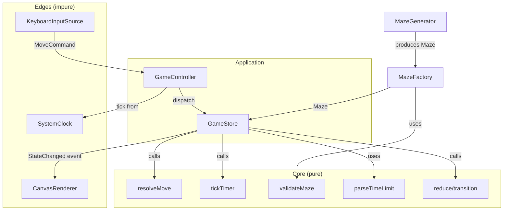
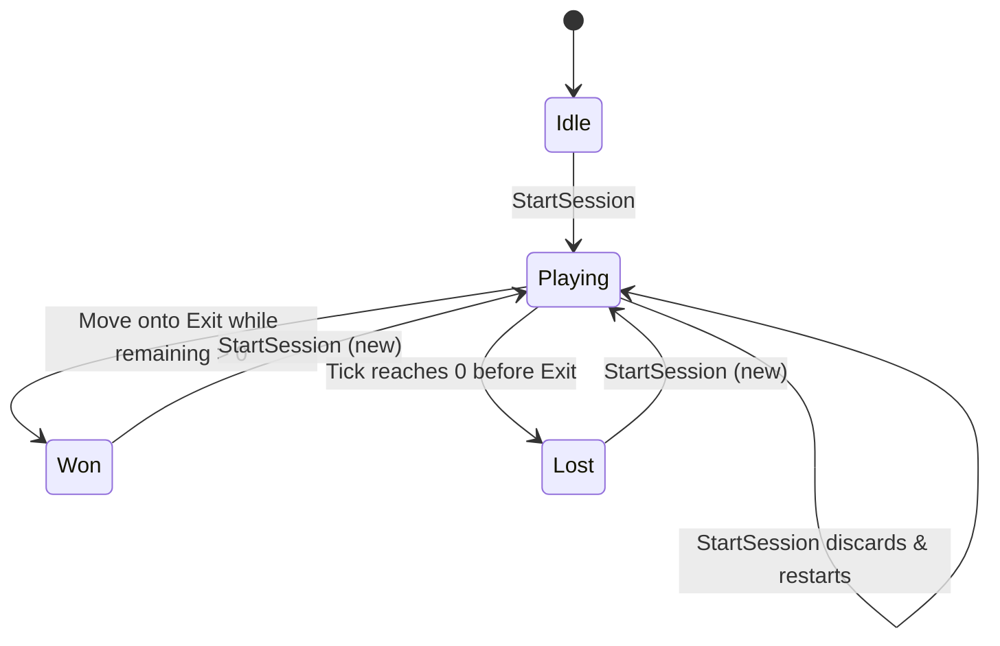

# Design Document

## Overview

The Maze Game is a single-player, browser-based game rendered on an HTML Canvas. The player navigates an avatar through a grid maze from a start cell to an exit cell before a countdown timer expires. This design translates the seven approved requirements into a modular TypeScript architecture that follows the workspace engineering standards: strict typing, clean code, SOLID boundaries, explicit design patterns, and a testing strategy built around Test-Driven Development with both example-based and property-based tests.

The central design principle is a strict separation between **pure core logic** and **impure edge adapters**. All game rules — maze validation, movement/collision resolution, timer countdown, and win/loss detection — are implemented as pure, deterministic functions and immutable data transformations. Side effects (Canvas rendering, keyboard input, wall-clock timing) are isolated behind small interfaces at the system edges and injected into the core. This keeps the game rules fully unit- and property-testable without a DOM, and lets us swap rendering, input, and timing implementations without touching tested logic.

### Requirement Coverage Map

| Requirement | Design element that addresses it |
| --- | --- |
| R1 Display the Maze | `Renderer` interface, `CanvasRenderer`, `Maze` model, maze validation in `MazeFactory` |
| R2 Move the Avatar | `MovementController`, `MoveCommand`, `resolveMove` pure function, in-progress move guard |
| R3 Enforce the Time Limit | `Timer`, `Clock` interface, `GameState` reducer, loss-on-expiry transition |
| R4 Win by Reaching the Exit | `resolveMove` + `GameState` reducer win transition, elapsed-time capture |
| R5 Report the Outcome | `GameStore` events, `Renderer.renderResult`, new-session control wiring |
| R6 Start a New Game Session | `GameSessionFactory`, `startSession` transition, timer pause-until-first-move |
| R7 Configure the Time Limit | `parseTimeLimit` pure validator, `TimeLimit` branded type, default constant |

## Architecture

The system is organized into three layers:

1. **Core (pure)** — Domain types and rule functions. No I/O, no `Date.now()`, no DOM. Deterministic given inputs.
2. **Application (orchestration)** — `GameStore` holds the current `GameState`, applies pure transitions, and emits change events. It depends only on core types and on injected edge abstractions (`Clock`, `MazeGenerator`).
3. **Edges (impure adapters)** — `CanvasRenderer` (implements `Renderer`), `KeyboardInputSource` (implements `InputSource`), and `SystemClock` (implements `Clock`). These are the only modules that touch the browser.



### Data flow for one move

1. `KeyboardInputSource` translates a key press into a `MoveCommand` (Command pattern) and hands it to the `GameController`.
2. `GameController` dispatches the command to the `GameStore`.
3. `GameStore` applies the pure `reduce(state, action)` transition, which calls `resolveMove` to compute the next avatar position and any win/loss transition.
4. `GameStore` emits a `StateChanged` event (Observer pattern).
5. `CanvasRenderer`, subscribed to the store, redraws from the new immutable state.

The `GameController` also drives the timer: on each animation frame it reads the `Clock`, computes elapsed time, dispatches a `Tick` action, and the store applies `tickTimer` and the loss-on-expiry transition.

### Dependency Inversion

`GameStore` and `GameController` depend on the abstractions `Clock`, `MazeGenerator`, `Renderer`, and `InputSource` — never on `window`, `Date`, `KeyboardEvent`, or `CanvasRenderingContext2D` directly. Concrete edge classes are constructed in a single composition root (`main.ts`) and injected. In tests, fakes are injected in their place.

## Components and Interfaces

Interfaces are kept small and focused (Interface Segregation). `Renderer` and `InputSource` are separate; timing is a separate `Clock`.

### Core domain types (see Data Models)

- `Maze`, `Cell`, `Position`, `Direction`, `GameState`, `GameStatus`, `TimeLimit`, `GameConfig`.

### `MazeGenerator` (Strategy)

Swappable maze-generation algorithms live behind one interface, satisfying Open/Closed — new algorithms are added as new implementations, not by editing existing ones.

```typescript
export interface MazeGenerator {
  /** Produce a maze that is guaranteed valid per validateMaze. */
  generate(rows: number, columns: number, rng: () => number): Maze;
}
```

Initial implementation: `RecursiveBacktrackerGenerator`. Because generation is seeded by an injected `rng: () => number`, generation is deterministic in tests.

### `MazeFactory` (Factory)

Centralizes maze construction and enforces the validity contract. It calls the injected `MazeGenerator`, then runs `validateMaze`; if validation fails it returns a typed error rather than throwing (fail fast at the boundary, R1.6).

```typescript
export type MazeResult =
  | { readonly ok: true; readonly maze: Maze }
  | { readonly ok: false; readonly error: MazeValidationError };

export interface MazeFactory {
  create(rows: number, columns: number): MazeResult;
}
```

### `GameSessionFactory` (Factory)

Builds a fresh `GameState` for a new session: places the avatar on the start cell, resets the timer to the configured `TimeLimit`, sets status to `Playing` with a paused timer, and clears any prior result (R6).

```typescript
export interface GameSessionFactory {
  createSession(config: GameConfig): GameState;
}
```

### `Clock` (edge abstraction for timing)

```typescript
export interface Clock {
  /** Monotonic time in milliseconds; used only for elapsed-time deltas. */
  now(): number;
}
```

`SystemClock` wraps `performance.now()`. A `FakeClock` is used in tests to advance time deterministically.

### `Renderer` (edge abstraction for output)

```typescript
export interface Renderer {
  renderMaze(maze: Maze): void;
  renderAvatar(position: Position, maze: Maze): void;
  renderRemainingTime(secondsRemaining: number): void;
  renderResult(result: GameResult): void;
  renderInvalidMaze(error: MazeValidationError): void;
  clearResult(): void;
}
```

`CanvasRenderer` implements `Renderer` against a `CanvasRenderingContext2D`. It contains no game logic — it is a pure projection of state onto pixels.

### `InputSource` (edge abstraction for input)

```typescript
export interface InputSource {
  /** Register a handler invoked with a MoveCommand when the player acts. */
  onCommand(handler: (command: MoveCommand) => void): void;
  /** Register a handler for the new-session / start control. */
  onNewSession(handler: () => void): void;
  dispose(): void;
}
```

`KeyboardInputSource` maps arrow/WASD keys to `MoveCommand`s and a button click to the new-session handler.

### `MoveCommand` (Command)

Movement input is represented as data, decoupling the source of input from its processing.

```typescript
export type MoveCommand = { readonly kind: "move"; readonly direction: Direction };
```

### `GameStore` (State + Observer)

Holds the single source of truth (`GameState`), applies pure transitions, and notifies observers. It never renders; it emits events that the renderer consumes.

```typescript
export type GameEvent =
  | { readonly type: "StateChanged"; readonly state: GameState }
  | { readonly type: "MoveBlocked" }
  | { readonly type: "InvalidMaze"; readonly error: MazeValidationError };

export interface GameStore {
  getState(): GameState;
  dispatch(action: GameAction): void;
  subscribe(observer: (event: GameEvent) => void): () => void;
}
```

### `GameController` (orchestration)

Wires the edges to the store: subscribes to `InputSource`, drives ticks from the `Clock` via the animation loop, and subscribes the `Renderer` to the store. It owns no rules — it only routes.

### Pure rule functions (Core, Single Responsibility)

Each rule is one small pure function, separately testable:

```typescript
export function validateMaze(maze: Maze): MazeValidationResult;
export function resolveMove(state: GameState, direction: Direction): GameState;
export function tickTimer(state: GameState, elapsedMs: number): GameState;
export function parseTimeLimit(input: unknown): TimeLimitResult;
export function reduce(state: GameState, action: GameAction): GameState;
```

## Data Models

All models are immutable (`readonly`) and use discriminated unions so that illegal states are unrepresentable (engineering standard: model illegal states as unrepresentable).

### Cell, Position, Direction

```typescript
export const enum CellKind {
  Path = "Path",
  Wall = "Wall",
}

/** Role a path cell plays; walls never have a role. */
export type CellRole = "Start" | "Exit" | "None";

export interface Position {
  readonly row: number;
  readonly column: number;
}

export type Direction = "Up" | "Down" | "Left" | "Right";
```

### Maze

```typescript
export interface Maze {
  readonly rows: number;
  readonly columns: number;
  /** grid[row][column] — Path or Wall. */
  readonly grid: ReadonlyArray<ReadonlyArray<CellKind>>;
  readonly start: Position;
  readonly exit: Position;
}
```

Invariants enforced by `validateMaze` (and by the `MazeFactory` before a session begins):
- exactly one start and one exit (R1.4),
- start and exit are different cells (R1.4),
- start and exit are Path cells,
- a start-to-exit path exists through 4-directionally adjacent Path cells (R1.5).

### TimeLimit (branded type)

To prevent an out-of-range number from being used as a time limit anywhere in the system, `TimeLimit` is a branded integer that can only be produced through `parseTimeLimit`.

```typescript
export type TimeLimit = number & { readonly __brand: "TimeLimit" };

export const MIN_TIME_LIMIT_SECONDS = 30;
export const MAX_TIME_LIMIT_SECONDS = 600;
export const DEFAULT_TIME_LIMIT_SECONDS = 60;
```

`parseTimeLimit` returns either a valid `TimeLimit`, or the default with an "invalid" flag so the UI can indicate the fallback (R7.3).

```typescript
export type TimeLimitResult =
  | { readonly ok: true; readonly value: TimeLimit }
  | { readonly ok: false; readonly value: TimeLimit; readonly reason: "not-integer" | "out-of-range" };
```

### GameState (State pattern as a discriminated union)

The game lifecycle is modeled as explicit states with defined transitions. Fields that only make sense in some states live only in those variants, so illegal combinations (e.g., a win with no elapsed time) cannot be constructed.

```typescript
export type GameStatus = "Idle" | "Playing" | "Won" | "Lost";

export interface BaseState {
  readonly maze: Maze;
  readonly avatar: Position;
  readonly timeLimit: TimeLimit;
}

export interface IdleState extends BaseState {
  readonly status: "Idle";
}

export interface PlayingState extends BaseState {
  readonly status: "Playing";
  readonly remainingMs: number;
  /** Timer is paused until first move or 1s elapses (R6.3). */
  readonly timerStarted: boolean;
  /** True while a move animation is in progress (R2.5). */
  readonly moveInProgress: boolean;
}

export interface WonState extends BaseState {
  readonly status: "Won";
  readonly elapsedMs: number;
}

export interface LostState extends BaseState {
  readonly status: "Lost";
  readonly reason: "TimeExpired";
}

export type GameState = IdleState | PlayingState | WonState | LostState;
```

### GameAction

```typescript
export type GameAction =
  | { readonly type: "StartSession"; readonly config: GameConfig }
  | { readonly type: "Move"; readonly direction: Direction }
  | { readonly type: "Tick"; readonly elapsedMs: number }
  | { readonly type: "MoveAnimationComplete" };
```

### GameConfig, GameResult, errors

```typescript
export interface GameConfig {
  readonly rows: number;
  readonly columns: number;
  readonly timeLimit: TimeLimit;
}

export type GameResult =
  | { readonly outcome: "Won"; readonly elapsedSeconds: number }
  | { readonly outcome: "Lost"; readonly reason: "TimeExpired" };

export type MazeValidationError =
  | "NoStart" | "MultipleStarts"
  | "NoExit" | "MultipleExits"
  | "StartEqualsExit"
  | "NoPathFromStartToExit";

export type MazeValidationResult =
  | { readonly ok: true }
  | { readonly ok: false; readonly error: MazeValidationError };
```

### State transition diagram



Transition rules (all pure, in `reduce`):
- **Move**: delegates to `resolveMove`. A move to a wall or out of bounds leaves the avatar unchanged and signals blocked (R2.2, R2.3). A move while `moveInProgress` is ignored (R2.5). A move while status is `Won`/`Lost`/`Idle` is rejected (R4.4). The first accepted move starts the timer (R6.3).
- **Move onto exit** while `remainingMs > 0` → `Won` with captured `elapsedMs` (R4.1, R4.2). Onto exit while `remainingMs <= 0` → no win (R4.5).
- **Tick**: `tickTimer` decreases `remainingMs`, clamped at 0 (never negative). Reaching 0 in `Playing` → `Lost` with `reason: "TimeExpired"` (R3.3).
- **StartSession**: always produces a fresh `PlayingState`, discarding any prior state (R6.5).

## Correctness Properties

*A property is a characteristic or behavior that should hold true across all valid executions of a system — essentially, a formal statement about what the system should do. Properties serve as the bridge between human-readable specifications and machine-verifiable correctness guarantees.*

The maze game's core is a set of pure functions (`validateMaze`, `resolveMove`, `tickTimer`, `parseTimeLimit`, `reduce`) over immutable data, so it is well suited to property-based testing. The following properties are derived from the acceptance criteria via the prework analysis and are deduplicated so each provides unique validation value. Each is implemented by a single fast-check property test running a minimum of 100 iterations.

### Property 1: Generated mazes are always valid and solvable

*For any* grid dimensions and any random seed, the maze produced by a `MazeGenerator` has exactly one start cell and exactly one exit cell that are distinct path cells, and there exists a sequence of 4-directionally adjacent path cells connecting the start to the exit.

**Validates: Requirements 1.4, 1.5**

### Property 2: Invalid mazes are rejected and no session starts

*For any* maze that violates a structural invariant (zero or multiple starts, zero or multiple exits, start equal to exit, or no adjacent-path route from start to exit), `validateMaze` returns the matching `MazeValidationError` and `MazeFactory.create` returns `ok: false`, so no `Playing` session is produced.

**Validates: Requirements 1.6**

### Property 3: A fresh session resets avatar, timer, and status with no leaked state

*For any* prior game state and any valid `GameConfig`, the session produced by `StartSession` places the avatar exactly on the maze start cell, sets `remainingMs` to `timeLimit * 1000`, has `timerStarted` false, has status `Playing`, and retains no avatar or timer value from the prior state.

**Validates: Requirements 1.2, 6.2, 6.3, 6.5, 7.4**

### Property 4: A valid move advances the avatar exactly one cell

*For any* `PlayingState` (with no move in progress) and any `Direction` whose target cell is inside the grid and is a path cell, `resolveMove` moves the avatar exactly one cell in that direction and to no other cell.

**Validates: Requirements 2.1**

### Property 5: The avatar never enters a wall or out-of-bounds cell

*For any* `PlayingState` and any `Direction` whose target cell is outside the grid or is a wall, `resolveMove` leaves the avatar position unchanged and signals that the move was blocked; consequently the avatar position is always an in-bounds path cell.

**Validates: Requirements 2.2, 2.3**

### Property 6: A move while a move is in progress is ignored

*For any* `PlayingState` with `moveInProgress` true and any `Direction`, applying a `Move` leaves the avatar position and status unchanged.

**Validates: Requirements 2.5**

### Property 7: The timer never goes negative and displayed seconds are non-negative

*For any* `PlayingState` and any non-negative elapsed milliseconds, `tickTimer` produces a `remainingMs` that is less than or equal to the previous value and never below zero, and the displayed remaining seconds equal `max(0, floor(remainingMs / 1000))`.

**Validates: Requirements 3.2**

### Property 8: Time expiring while not on the exit ends the session as a loss

*For any* `PlayingState` whose avatar is not on the exit cell, a `Tick` whose elapsed time is greater than or equal to the remaining time transitions the state to `Lost` with reason `TimeExpired`.

**Validates: Requirements 3.3**

### Property 9: Ended sessions freeze the timer

*For any* `WonState` or `LostState`, applying a `Tick` action leaves the state unchanged, so the captured elapsed time and outcome are retained.

**Validates: Requirements 3.4, 3.5**

### Property 10: Reaching the exit with time remaining wins and captures elapsed time

*For any* `PlayingState` whose `remainingMs` is greater than zero and any `Direction` whose target is the exit cell, `resolveMove` transitions the state to `Won` and records an `elapsedMs` equal to the elapsed time accumulated for the session.

**Validates: Requirements 4.1, 4.2, 3.5**

### Property 11: Reaching the exit without time remaining does not win

*For any* `PlayingState` whose `remainingMs` is less than or equal to zero and any `Direction` whose target is the exit cell, `resolveMove` does not transition the state to `Won`.

**Validates: Requirements 4.5**

### Property 12: Any move after the session ends is rejected

*For any* `WonState`, `LostState`, or `IdleState` and any `Direction`, applying a `Move` leaves the avatar position and status unchanged.

**Validates: Requirements 4.4**

### Property 13: Valid time limits are accepted unchanged

*For any* integer between 30 and 600 inclusive, `parseTimeLimit` returns `ok: true` with a value equal to the input, and a session built from that limit has `remainingMs` equal to the limit times 1000.

**Validates: Requirements 7.1, 7.4**

### Property 14: Invalid time limits fall back to the default with a reason

*For any* value that is not an integer or is outside the range 30 to 600, `parseTimeLimit` returns `ok: false` with a value equal to `DEFAULT_TIME_LIMIT_SECONDS` and a reason of `not-integer` or `out-of-range`.

**Validates: Requirements 7.3**

## Error Handling

Errors are handled by failing fast at boundaries and modeling failure as typed data rather than thrown exceptions, so the type system forces callers to handle both outcomes.

- **Invalid maze (R1.6):** `MazeFactory.create` returns `MazeResult` (`ok: false` with a `MazeValidationError`). The `GameStore` never enters `Playing`; it emits an `InvalidMaze` event that `CanvasRenderer.renderInvalidMaze` displays. No exception is thrown for expected invalid input.
- **Invalid time limit (R7.3):** `parseTimeLimit` returns a `TimeLimitResult`. On `ok: false` the caller uses the supplied default `TimeLimit` and surfaces the `reason` so the UI can indicate the fallback. Because `TimeLimit` is a branded type only produced by `parseTimeLimit`, an unvalidated number can never reach the timer.
- **Blocked movement (R2.2, R2.3):** Not an error but an expected outcome. `resolveMove` returns the unchanged state, and the store emits `MoveBlocked` so the renderer can give feedback (e.g., a shake or tone).
- **Input after session end (R4.4):** `reduce` ignores `Move` actions in `Won`/`Lost`/`Idle` states; the state is returned unchanged.
- **Concurrent move (R2.5):** guarded by the `moveInProgress` flag; extra `Move` actions are dropped by `reduce`.
- **Programming errors** (e.g., a grid whose row lengths differ from `columns`): validated in `validateMaze`; these are internal invariants and, if violated, indicate a bug — they are caught by tests rather than handled at runtime. Edge adapters (`CanvasRenderer`, `KeyboardInputSource`) validate their DOM handles (canvas context present, element found) at construction and fail fast with a clear error in the composition root, since a missing canvas is unrecoverable.

Untrusted external input (a player-specified time limit from a URL param or form field) is treated as `unknown` and passes through `parseTimeLimit` before use.

## Testing Strategy

Testing follows the workspace TDD standard — Red → Green → Refactor — with no production logic written before a failing test. Every acceptance criterion maps to at least one test. The suite combines example-based unit tests and property-based tests, and targets ≥ 90% coverage on core logic.

### Tooling

- **Vitest** as the test runner (TypeScript-native, fast).
- **fast-check** for property-based tests. Properties are not implemented from scratch; each correctness property is realized by a single fast-check property with a minimum of **100 iterations**.
- **ESLint (typescript-eslint) + Prettier** enforced in CI; zero lint errors in committed code.
- Coverage via Vitest's coverage provider, reported in `test:coverage`.

### Unit tests (example-based)

Focus on specific examples, edge cases, integration points, and the rendering/timing concerns that are not universal properties:

- Renderer interactions (mock `Renderer`): maze/avatar/exit drawn (R1.1, R1.2, R1.3), avatar re-rendered after a move (R2.4), win/loss result messages rendered (R4.3, R5.1, R5.2), result persists until new session and `clearResult` is called on new session (R5.3, R5.4, R5.5, R6.4).
- `parseTimeLimit(undefined)` returns the 60s default (R7.2).
- New-session control wiring: activating it dispatches `StartSession` (R5.4, R6.1).
- Timer loop: `GameController` reads the injected `FakeClock`, dispatches `Tick`, and stops dispatching once ended (R3.1 start value, R6.3 auto-start-after-1s).
- Representative maze-generation examples and known solvable/unsolvable fixtures for `validateMaze`.

### Property-based tests

Each property from the Correctness Properties section is implemented as one fast-check property with ≥ 100 iterations. Custom arbitraries generate valid mazes, `PlayingState`s (avatar on a random path cell, random remaining time), directions, and time-limit inputs (integers, floats, out-of-range, non-numbers). Side-effecting collaborators are faked: a `FakeClock` for time and a mock `Renderer`, so property tests exercise pure logic deterministically.

Each property test carries a tag comment referencing its design property, in the format:

```
// Feature: maze-game, Property 5: The avatar never enters a wall or out-of-bounds cell
```

Property-to-requirement traceability is given in the Correctness Properties section above.

### Determinism

`MazeGenerator` takes an injected `rng: () => number`, and timing goes through the `Clock` abstraction, so both generation and timing are deterministic under test. No test depends on wall-clock time or `Math.random` directly.

### Coverage targets

Core modules — maze generation, `validateMaze`, `resolveMove`, `tickTimer`, `parseTimeLimit`, and the `reduce` transition — must reach ≥ 90% line and branch coverage. Edge adapters are covered by mock-based unit tests; the composition root is exercised by a smoke test.

### Continuous Integration

The project provides npm scripts `lint`, `typecheck`, `test`, `test:coverage`, and `build`. A GitHub Actions workflow at `.github/workflows/ci.yml` runs on every push and pull request and executes, in order: `npm ci`, `npm run lint`, `npm run typecheck`, `npm run test:coverage`, `npm run build`. The pipeline fails if any step fails, keeping `main` green.
