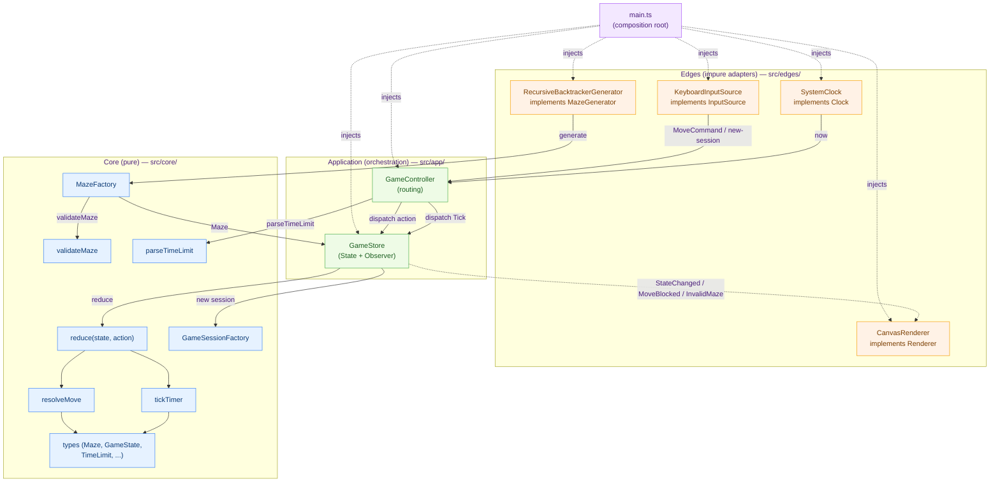

# Software Architecture (in extenso)

This is the full software-architecture reference for the maze game. It expands on the
`architecture` steering doc, which is the short, always-on summary. This document is the
detailed "why" and "how"; the steering doc is the enforceable digest.

Scope: **software architecture only** — module structure, ports/adapters, dependency
direction, and how components integrate at runtime. Cloud/deployment architecture is a
separate concern; see [`aws-decisions.md`](./aws-decisions.md).

## Style: Hexagonal (Ports and Adapters)

The project follows a hexagonal architecture (ports and adapters). The game rules are the
valuable, long-lived core; browser concerns (Canvas rendering, keyboard input, wall-clock
timing) and — in later phases — backend concerns (persistence, identity, networking) are
replaceable adapters that plug into the core through small interfaces (ports).
 
The guiding principle is a strict separation between **pure core logic** and **impure edge
adapters**:

- **Core is pure and deterministic.** All game rules — maze validation, movement/collision
  resolution, timer countdown, win/loss detection, session lifecycle — are pure functions
  over immutable data. The core reaches no I/O, no `Date.now()`, no DOM, and no
  `Math.random()` directly. Randomness and time enter only through injected abstractions
  (`rng: () => number`, `Clock`).
- **Side effects live at the edges.** Rendering, input, timing (and later networking,
  storage, auth) are implemented as adapters behind ports and injected into the core.

## Layers

| Layer | Location | Responsibility | May depend on |
| --- | --- | --- | --- |
| Core (pure) | `src/core/` | Domain types and rule functions | nothing outside itself |
| Application (orchestration) | `src/app/` | Hold state, apply core transitions, emit events | core + ports |
| Edges (impure adapters) | `src/edges/` | Touch the outside world; implement ports | app + core |

### Core (`src/core/`)
Domain types (`types.ts`) and pure rule functions: `validateMaze`, `resolveMove`,
`tickTimer`, `parseTimeLimit`, `reduce`, maze generation, and the session factory.
Deterministic given inputs, so fully unit- and property-testable without a DOM.

### Application (`src/app/`)
`GameStore` (State + Observer) holds the single `GameState`, applies pure transitions on
`dispatch`, and emits `GameEvent`s. `GameController` routes: it subscribes to the
`InputSource`, drives `Tick` from the injected `Clock` via the animation loop, and
subscribes the `Renderer` to the store. Neither depends on `window`, `Date`,
`KeyboardEvent`, or `CanvasRenderingContext2D` — only on ports.

### Edges (`src/edges/`)
`CanvasRenderer` implements `Renderer`; `KeyboardInputSource` implements `InputSource`;
`SystemClock` implements `Clock`. These are the only modules that touch the browser. Each
is a thin adapter with no game logic.

## Ports and Adapters

Ports are the small, segregated interfaces the inside depends on. Adapters are their
concrete implementations, constructed in the composition root (`src/main.ts`) and injected.

| Port (interface) | Adapter (Phase 1) | Purpose |
| --- | --- | --- |
| `Clock` | `SystemClock` (`performance.now()`) | Monotonic time for elapsed-time deltas |
| `Renderer` | `CanvasRenderer` | Project state onto the Canvas |
| `InputSource` | `KeyboardInputSource` | Turn key/control events into `MoveCommand`s |
| `MazeGenerator` | `RecursiveBacktrackerGenerator` | Produce a valid maze (Strategy) |

New adapters (a touch input source, a WebGL renderer, a network clock) are added as new
implementations of these ports, never by editing tested core code (Open/Closed).

## Dependency Rule

Dependencies point **inward**: edges → application → core. The core depends on nothing
outside itself; the application depends only on core types and ports; edges implement
ports. Enforced import constraints:

- No import from `core/` may reference `app/` or `edges/`.
- No import from `app/` may reference `edges/`.

Concrete adapters are wired only in the composition root and injected (Dependency
Inversion). Tests inject fakes (`FakeClock`, mock `Renderer`) in their place.

## Component Integration Diagram

The diagram shows the ports-and-adapters structure and the runtime flow of one move and one
timer tick. Solid arrows are direct calls/data; dashed arrows are event notifications.

### One move, end to end
1. `KeyboardInputSource` translates a key press into a `MoveCommand` (Command pattern) and
   hands it to `GameController`.
2. `GameController` dispatches the command to `GameStore`.
3. `GameStore` applies `reduce(state, action)`, which calls `resolveMove` to compute the
   next avatar position and any win/loss transition.
4. `GameStore` emits a `StateChanged` event (Observer pattern).
5. `CanvasRenderer`, subscribed to the store, redraws from the new immutable state.

### One timer tick
`GameController` reads the `Clock` each animation frame, computes elapsed time, dispatches a
`Tick`, and the store applies `tickTimer` plus the loss-on-expiry transition, then emits
`StateChanged`.

## Patterns in Use

- **Strategy** — swap maze-generation algorithms behind `MazeGenerator`.
- **State** — the game lifecycle (`Idle`, `Playing`, `Won`, `Lost`) as a discriminated union.
- **Observer / Event Emitter** — `GameStore` emits events; the renderer consumes them.
- **Factory** — `MazeFactory` and `GameSessionFactory` centralize construction.
- **Command** — movement input represented as `MoveCommand` data.
- **Dependency Injection** — collaborators passed in, wired at the composition root.

## How Later Phases Extend This (without breaking the core)

The multiplayer scoring platform (Phase 2) adds capabilities as **new ports and adapters
around the same pure core**, not as changes to it:

- Score persistence → a `ScoreRepository` port with an AWS-backed adapter.
- Identity → an `AuthProvider` port with a Cognito-backed adapter.
- Real-time shared sessions → a `SessionChannel` port with a WebSocket/AppSync adapter.

The rules stay pure; the cloud lives at the edges. The concrete AWS choices and the timing
of those decisions are recorded in [`aws-decisions.md`](./aws-decisions.md).
